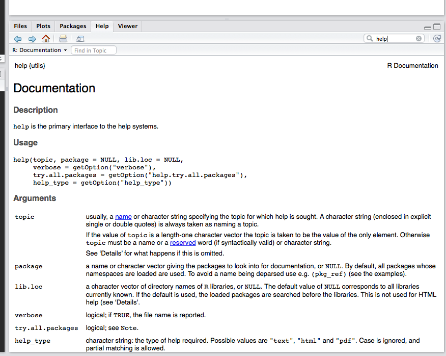

<style type='text/css'>
code.r {
  font-size: 18px;
}

pre {
 font-size: 20px;
 margin-bottom: -8px; 
}
</style>
```{r setup, include=FALSE}
knitr::opts_chunk$set(echo = TRUE)
```


## About R 
```{r, out.width="100px", out.height="100px", echo=FALSE}
knitr::include_graphics("Images/Rlogo.png")
```

+ "R is a language and environment for statistical computing and graphics."
+ R is open-source, free software distributed under a GNU GPL-3 license.
    - Collaborative improvement
    - Extensible through contributed packages
+ R is distributed by the R software foundation and maintained by the
R core team. 

## About RStudio

+ RStudio is an "integrated development environment" for working with R
    - Simplifies many tasks and makes for a friendlier introduction
    - Great for integrating R code with text for creating documents
    - Use RStudio to streamline your workflow.

+ Distributed by a company of the same name that also offers a number of related
products for working with data:
    - Shiny for interactive graphics
    - Enterprise and server editions

## Objects
+ Everything in R is an 'object'
+ Objects belong to classes. Some important classes are:

```{r classes, echo=TRUE}
class('String')
class(42); class(integer(42))
class(class)
```

## Environments
+ Objects live in environments.
+ Below we create a vector `x` in the global environment:

```{r,echo=TRUE}
ls()
x <- c(1,2,3,4,5)
ls()
```
+ Use the function `ls()` to get a list of the objects in an environment.
+ The default environment is the global environment.

## R Syntax
+ Assign values to named objects: `x <- 1:5`.
+ Use `c()` to concatenate values in a vector `y <- c(6,7,8,9,10)` 
+ Parentheses `c()` indicated that an object is a function, items within are
parameters.
+ Vectors are indexed using square brackets `[]`:
```{r echo=TRUE}
 x <- 1:5
 x
 x[1]
 x[c(3,5)]
```

# R Scripts

## R scripts
+ Scripts are files that contain R commands.
+ Scripts end in `.R`
+ While you **can** type commands directly in the console, analyses should
be written in R scripts so you can modify and reproduce as needed.
+ If you haven't already, open the `Method-Seminar-10March2017.R` script 
in RStudio. 
+ Run the entire contents of a script with the `source()` command: 

## Headers and comments 
+ Create a standard header for your R scripts that explains what they do.
+ The comment character is `#`, R ignores anything that appears after a `#`.

```{r echo=TRUE}
## IHPI Methods Seminar - March 10, 2017 ##
#! Develop a standard header for your R scripts
#!  so you can quickly recall what it does in the future.

## This script introduces R and shows how to read and write data ##
## Author: James Henderson (jbhender@umich.edu)
## Created: Feb 9, 2017
## Updated: Feb 23, Mar 8, 2017

## these are comments, comments make scripts readable 
#! This comment style is used with notes intended for you 
```

## More on environments
+ Start with a clean environment
```{r echo=TRUE}
# make sure you are starting with a fresh workspace #
rm(list=ls()) # rm deletes items from environments
ls() # list items in the global environment
```
+ 
+ Several environments are loaded by default
```{r echo=TRUE}
# The search path specifies environments where R looks for objects # 
search()
tail(ls('package:base'))
```

## Accessing help

+ Accessing help from the console
```{r echo=TRUE}
#! two ways to get see help files for R functions 
help(rm)
?ls()
```
+ 
+ Use the help menu directly in RStudio

```{r out.height="300px", echo=FALSE}

```

## Working directory
+ The working directory is where R looks for and writes files by default.
+ Change `~/Desktop` with a path to your desktop: i.e. `C:\\Desktop`
+ RStudio should handle the Windows (`\`) and Linux (`/`) differences.

```{r echo=TRUE}
# create an object with a path to our data set#
path <- '~/Desktop/Rworkshop/chsi_dataset' #! useful if changed later
setwd(path)
getwd()
head(dir(path))
```

# Working with Data

## Reading data 
+ We will focus on reading data from text files such as: `.csv`, `.txt`, `.tab`.
+ For tab separated files use `sep='\t'`.
+ See also: `read.csv`

```{r echo=TRUE}
#########################
### Working with data ###
#########################

## read in data stored in a csv file ##
dataFile <- sprintf('%s/LEADINGCAUSESOFDEATH.csv',path)
leadDeath <- read.table(file=dataFile,sep=',',header=T)
#! I generally use camelCase for names of objects.
```

## Inspecting data
```{r echo=TRUE}
## get some information about leadDeath ##
class(leadDeath)
dim(leadDeath)   ## for objects with at least 2 dimensions
head(names(leadDeath)) ## see the names of all variables in leadDeath

```

## Inspecting functions
```{r echo=TRUE}
sprintf   ## view the code called by a function by omitting the ()
head(read.table)
```

## Defining your own functions
```{r echo=TRUE}
## You can define your own functions in R.
#! Use functions to avoid repeated use of the same code blocks. 
dim2 <- function(obj){
  # This function returns either the dimensions of an object or its
  # length if it is unidimensional. 
  if(is.null(dim(obj))){
    return(length(obj))
  } else{
    return(dim(obj))
  }
}

dim2(leadDeath); dim(leadDeath)
```

## Searching for strings
- `grep()` finds all instances of a string or regular expression
- `match()` returns the index of the first exact matching instance

```{r echo=TRUE}
# search for variables names containing a specific string #
grep('State',names(leadDeath))
names(leadDeath)[c(1,4,5)]
match('CHSI_State_Name',names(leadDeath))
```

## Factors
```{r echo=TRUE}
## extract a specific variable from leadDeath ##
states <- leadDeath$CHSI_State_Name
length(states) ## for objects with a single dimension
class(states)
head(levels(states)) # get the levels of a factor; see also ?relevel()
head(unique(states)) # get the unique values
```

## Change classes by coercion
+ The class of an object can be changed using the `as.**` template
```{r}
## changes states to characer class ##
states <- as.character(states)
class(states)
#! R stores objects by value, 
#  so changing states does not feed back to leadDeath
class(leadDeath$CHSI_State_Name)
statesFactor <- unique(leadDeath$CHSI_State_Name)
```

## Indexing and assignment
```{r}
## We use [] for indexing vectors, matrices and (sometimes) data.frames
firstState=states[1] # equal as assignment
firstState
firstState='Alaska'
firstState
states[1]
#! Use <- for assignment since '=' should be symmetric
## Left to right assignment allowed but bad style ##
states[length(states)] -> lastState
```

## Indexing data.frames
```{r}
## tell read.table not to interpret strings as factors 
dataFile2 <- sprintf('%s/MEASURESOFBIRTHANDDEATH.csv',path)
birthDeath <- read.table(file=dataFile2,sep=',',header=T,
                         stringsAsFactors=FALSE)
```

```{r}
## Extract columns of interest ##
# by index
lowBirthWeightData <- birthDeath[,c(3,4,5,7,8)]
head(lowBirthWeightData)
```

## Indexing data.frames
```{r}
# Negative indexing 
head(lowBirthWeightData[,-c(3,5)])

# by name
lowBirthWeightData <- birthDeath[,c('CHSI_County_Name',
                                    'CHSI_State_Name',
                                    'CHSI_State_Abbr',
                                    'LBW',
                                    'LBW_Ind')
                                 ]
```

## Indexing data.frames
```{r}
# Create a new data-frame using 'with' 
lowBirthWeightData <- with(birthDeath,
                           data.frame(County=CHSI_County_Name,
                                      State=CHSI_State_Name,
                                      StateCode=CHSI_State_Abbr,
                                      LBW=LBW,LBWind=LBW_Ind,
                                      InfantMort=Infant_Mortality,
                                      InfantMortInd=
                                        Infant_Mortality_Ind
                          )
                      )
lowBirthWeightData[1:4,]
```

## Apply a function to all columns in a data.fame
```{r}
## lapply and sapply are for lists -- data.frames are lists 
lBWD_class <- lapply(lowBirthWeightData,class)
class(lBWD_class)
lBWD_class[1]; lBWD_class[[1]]
sapply(lowBirthWeightData,class)
```

## Missing values
```{r}
# In R, the missing value charachter is NA
na.ind <- with(lowBirthWeightData,which(LBW < 0))
lowBirthWeightData_original <- lowBirthWeightData
# na.ind <- which(lowBirthWeightData$LBW < 0)
lowBirthWeightData$LBW[na.ind] <- NA

head(lowBirthWeightData_original$LBW[na.ind])
head(lowBirthWeightData$LBW[na.ind])
```

## A functional approach 
```{r}
## A functional approach 
replaceNA <- function(input){
  input[which(input < 0)] <- NA
  return(input)
}

for(i in 4:7){
  lowBirthWeightData[,i] <- replaceNA(lowBirthWeightData[,i])
}
```

## Saving data
+ You can save R objects by name using an `file_name.RData` file.
```{r}
# saving data to file to read into R later #
save(lowBirthWeightData,file='./lowBirthWeightData.RData')

# write data to csv file for export and sharing with others
write.csv(lowBirthWeightData,file='./lowBirthWeightData.csv',
          row.names=F,quote=F)
```

# Packages 

## About packages 
+ User written extension to R are distributed as packages
+ Most specialized methods and procedures are in packages
+ Packages are an excellent way to organize and document code you write.
+ Install packages from a 'mirror' site using `install.packages('foreign')`
+ Load installed packages using `library()`
+ Some common packages:
    - `lme4` for mixed models
    - `survival` for survival analysis
    - `ggplot2` for advanced plotting

## The `foreign` package
+ Change to `TRUE` to install the `foreign` package
+ You may be prompted to choose a site to download from
```{r}
if(FALSE) install.packages('foreign')
help(read.xport)
head(foreign::read.xport)
```

## Loading a package
```{r}
## You must add the package name to the 
## search path to call its functions by name 
library(foreign)
help(read.xport)
```
+  
+ You can use `foregin::read.xport` and `foreign::read.ssd` to import
SAS data.

## 