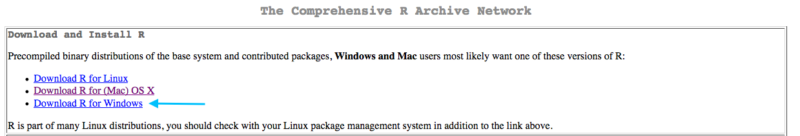
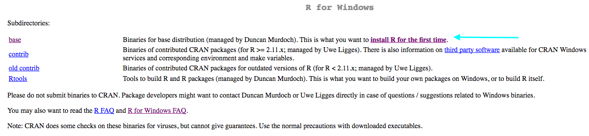
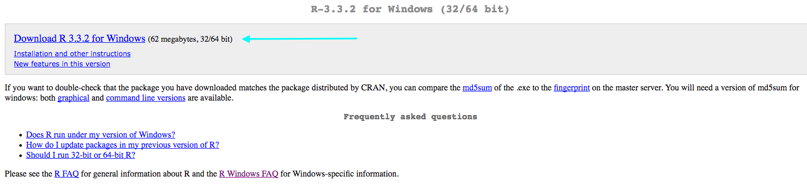
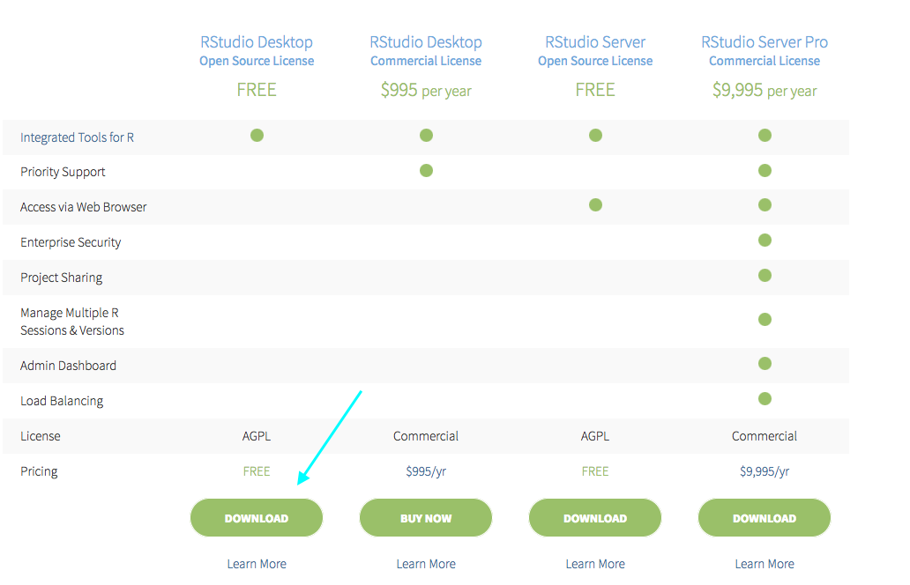
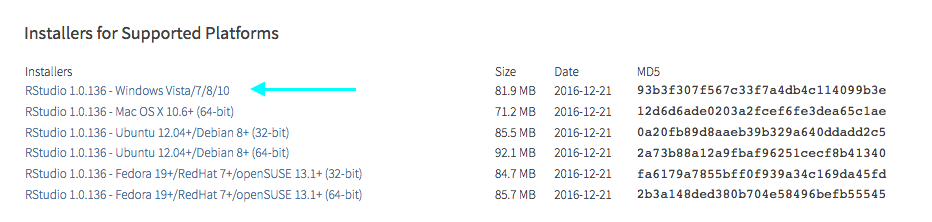
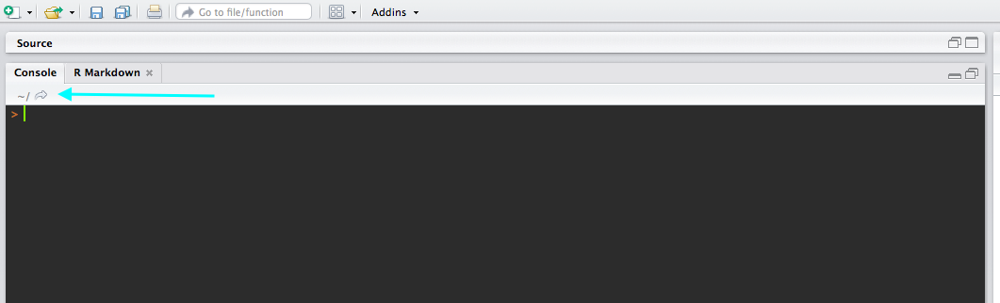
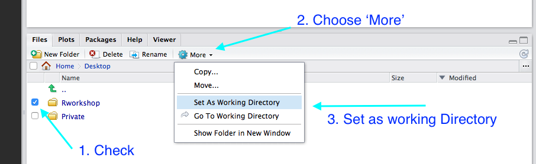
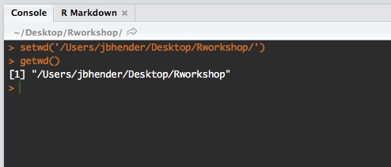

```{r setup, include=FALSE}
knitr::opts_chunk$set(echo = TRUE)
```

## Welcome
I look forward to working with you all at an upcoming workshop.
To maximize our time during the workshop,
please prepare using the checklist below.

## Checklist
1. Download and install R: https://cran.r-project.org/
2. Download and install RStudio: https://www.rstudio.com/products/rstudio/download/
3. Create an 'Rworkshop' folder on your desktop and move the data to that folder.
4. Open RStudio and set the working directory to the 'Rworkshop' folder you just created.
6. Download the workshop files (right click to save): 
    + <a href='https://jbhender.github.io/Intro_2_R.html'> Day 1: Introduction to R </a>
    + For day 1 <a href='https://github.com/jbhender/Workshops/tree/master/Intro_2_R/attitudes.csv' > attitudes.csv </a>
    + For day 1 (Intro to R) and day 3 (regression):
    <a href='https://jbhender.github.io/cars.csv' > cars.csv </a>

## Download and Install R

1. Visit: https://cran.r-project.org/



2. Choose the download appropriate for your computer.
3. Windows users should install the R binary by clicking 'install R for the first time'.


4. A link to the download and installation instructions are on the next page.



## Download and Install RStudio
We will use RStudio in the workshop.
While R comes with its own graphical user interface, the RStudio interface
provides additional functionality and simplifies many tasks. Make sure you install
R **before** installing RStudio!

1. Visit: https://www.rstudio.com/products/rstudio/download/
2. You want to install the free RStudio Desktop



3. Download the appropriate installer and follow the prompts.



## Create 'Rworkshop' folder

Please Create a new folder 'Rworkshop' on your *desktop*. Please keep any workshop files
you download here (there are no files to download presently.)

## Set working directory

We will use the 'Rworkshop' folder as the working directory for reading and
writing files. We will review this at the start of the workshop, but it would be
useful to do in advance.

1. Open RStudio - the appearance may differ somewhat from the screenshot.



2. Use the 'Files' tab on the left or click the arrow to bring up file navigation.
3. Navigate to the Desktop and check the box next to the Rworkshop folder.
4. Select 'More' and choose 'Set as Working Directory'


5. Check that you were successful by typing `getwd()` in the console to the left.
You should see the full path to the 'Rworkshop' folder.



## Links to workshop files 
Links to workshop files will be placed here as they become available. 
Download the 'attitudes.csv' file and **move it** to an 'RWorkshop' folder on your desktop:

- <a href='https://github.com/jbhender/Workshops/tree/master/Intro_2_R/attitudes.csv' > attitudes.csv </a>