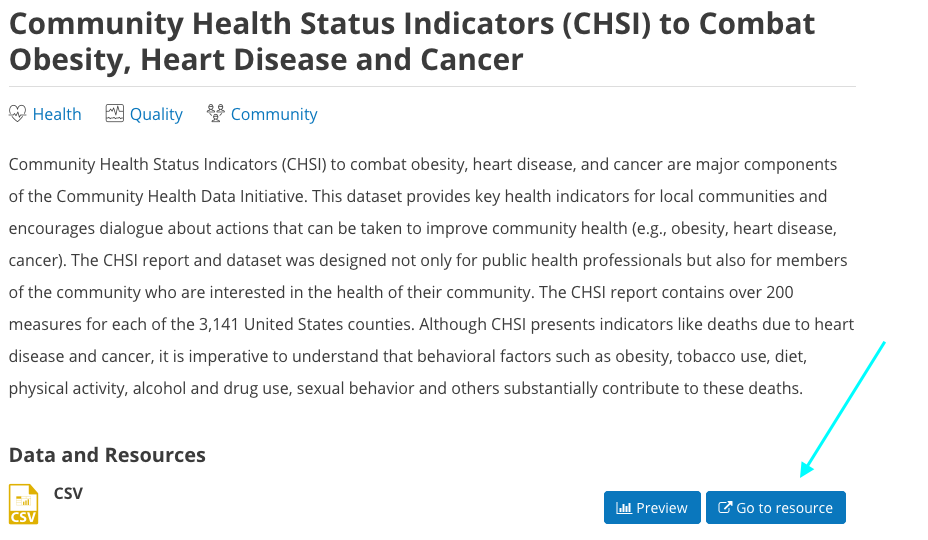

```{r setup, include=FALSE}
knitr::opts_chunk$set(echo = TRUE)
```

## Welcome
I look forward to working with you all at the IHPI Methods Seminar,
**Friday March 10, 10am-12noon**. To maximize our time during the workshop,
please prepare using the checklist below.

## Checklist
1. Download and install R: https://cran.mtu.edu/
2. Download and install RStudio: https://www.rstudio.com/products/rstudio/download/
3. Download data for seminar examples: 
https://www.healthdata.gov/dataset/community-health-status-indicators-chsi-combat-obesity-heart-disease-and-cancer
4. Create an 'Rworkshop' folder on your desktop and move the data to that folder.
5. Open RStudio and set the working directory to the 'Rworkshop' folder you just created.
6. Download the workshop files (right click to save): 
    + <a href="Methods-Seminar-10March2017.R">Methods-Seminar-10March2017.R</a>
    + <a href="Analysis-and-Graphics.R">Analysis-and-Graphics.R</a>
    + Optionally:
        + <a href="Methods-Seminar-Presentation.Rmd"> Presentation source file</a>
        + <a href="ggplot2-primer.R"> ggplot2-primer.R</a>

## Download and Install R

1. Visit: https://cran.mtu.edu/


2. Choose the download appropriate for your computer.
3. Windows users should install the R binary by clicking 'install R for the first time'.


4. A link to the download and installation instructions are on the next page.


## Download and Install RStudio
We will use RStudio in the workshop.
While R comes with its own graphical user interface, the RStudio interface
provides additional functionality and simplifies many tasks. Make sure you install
R **before** installing RStudio!

1. Visit: https://www.rstudio.com/products/rstudio/download/
2. You want to install the free RStudio Desktop


3. Download the appropriate installer and follow the prompts.


## Download Data
Examples in the workshop will use the Community Health Status Indicators dataset 
from Health.gov. Download the data by visiting:
https://www.healthdata.gov/dataset/community-health-status-indicators-chsi-combat-obesity-heart-disease-and-cancer


Make sure to unzip the download, you should see a folder 'chsi_dataset'.

## Create 'Rworkshop' folder

Please Create a new folder 'Rworkshop' on your *desktop* and move the 'chis_dataset' folder
to this location. 

## Set working directory

We will use the 'Rworkshop' folder as the working directory for reading and
writing files. We will review this at the start of the workshop, but it would be
useful to do in advance.

1. Open RStudio - the appearance may differ somewhat from the screenshot.


2. Use the 'Files' tab on the left or click the arrow to bring up file navigation.
3. Navigate to the Desktop and check the box next to the Rworkshop folder.
4. Select 'More' and choose 'Set as Working Directory'


5. Check that you were successful by typing `getwd()` in the console to the left.
You should see the full path to the 'Rworkshop' folder.


## Links to workshop files 
Please download the two R scripts below:

+ <a href="Methods-Seminar-10March2017.R">Methods-Seminar-10March2017.R</a>
+ <a href="Analysis-and-Graphics.R">Analysis-and-Graphics.R</a>
+ Optionally:
    + <a href="Methods-Seminar-Presentation.html"> Slides</a>
    + <a href="Methods-Seminar-Presentation.Rmd"> Presentation source file</a>
    + <a href="ggplot2-primer.R"> ggplot2-primer.R</a>

### You're all set -- see you Friday!!